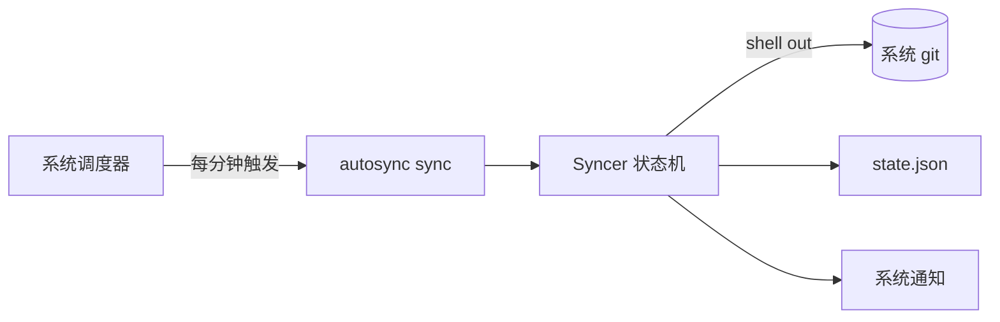

# AutoSync

> 基于系统 git 的跨平台文件夹双向同步工具。配置一次，自动提交、合并、冲突处理，完全无感。


把任意本地文件夹变成一个自动同步的 git 仓库——本地改动自动提交推送，其他设备的改动自动 rebase 合并，冲突按策略自动处理且零丢失。单二进制 + 一个 YAML 配置，程序不常驻，由系统调度器每分钟触发一次。

## 特色

- **双向同步**：本地 ⇄ 远程自动一致，rebase 合并非冲突分叉。
- **冲突零丢失**：三策略可选——`local_wins` 备份远程旧版本到分支可恢复、`remote_wins` 重置、`abort` 中止。强推一律 `--force-with-lease`。
- **真正无感**：成功静默，仅初始化 / 冲突 / 失败弹系统通知。
- **开箱健壮**：网络操作指数退避重试、单实例锁防并发、备份分支自动清理。
- **调度自安装**：`install` 一键注册系统定时任务（Windows schtasks）。
- **dry-run 预览**：只读输出同步计划，不联网不改仓库。

## 快速开始

```bash
# 构建（需 Go 1.26+ 与系统 git）
make build

# 配置
cp config.example.yaml config.yaml
# 填写 repo_dir 与 remote_url

# 运行
autosync                       # 单次同步
autosync install --config <path>   # 注册每分钟定时任务
```

## 架构



Syncer 依赖 `GitOperator` 接口（依赖倒置），shell out 调系统 git，不内嵌 git 库。详见 [docs/tech.md](docs/tech.md)。

## 平台

| 平台 | 同步核心 | 调度自安装 |
|------|----------|-----------|
| Windows | ✅ | ✅ schtasks |
| macOS / Linux | ✅ | 手动 cron |

## 文档

[prd](docs/prd.md) · [tech](docs/tech.md) · [api](docs/api.md) · [flow](docs/flow.md) · [TODO](docs/TODO.md)

## 路线图

- **跨平台调度自安装**：launchd（macOS）/ cron（Linux）原生支持
- **实时同步**：daemon 模式 + 文件监听，亚分钟级延迟
- **多文件夹**：单进程多任务管理
- **易用性**：HTTPS token 引导、连续失败降噪、托盘状态可视化

完整不足与方向见 [docs/TODO.md](docs/TODO.md)。

## License

[MIT](LICENSE)
