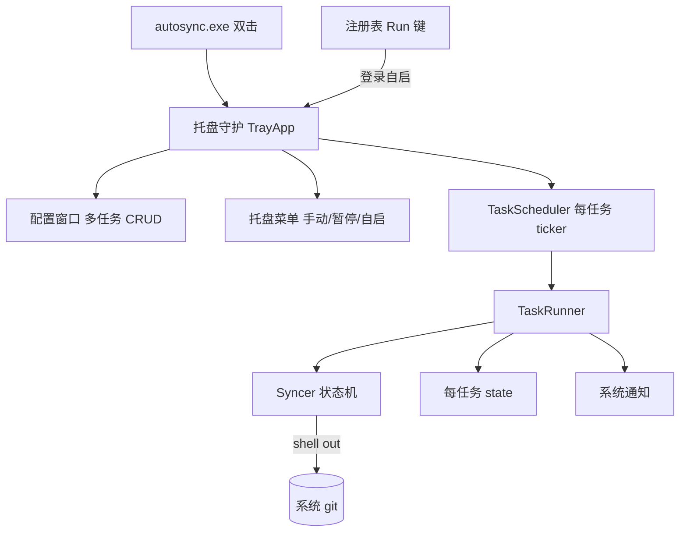

# AutoSync

<p align="center"></p>

> 基于系统 git 的跨平台文件夹双向同步工具。双击即用，托盘常驻，自动提交、合并、冲突处理，完全无感。


把任意本地文件夹变成自动同步的 git 仓库——本地改动自动提交推送，其他设备的改动自动 rebase 合并，冲突按策略自动处理且零丢失。双击 exe 弹配置窗口，填好多任务后最小化到托盘，后台定时同步，右键手动触发。

## 特色

- **托盘常驻**：双击启动 → 配置窗口 → 后台托盘定时同步，右键手动同步 / 暂停。开机自启一键开关。
- **多任务**：一份配置管多个文件夹，各自独立状态与锁。
- **双向同步**：本地 ⇄ 远程自动一致，rebase 合并非冲突分叉。
- **冲突零丢失**：三策略——`local_wins` 备份远程旧版本到分支可恢复、`remote_wins` 重置、`abort` 中止。强推一律 `--force-with-lease`。
- **真正无感**：成功静默，仅初始化 / 冲突 / 失败弹系统通知。
- **开箱健壮**：网络操作指数退避重试、单实例锁防并发、备份分支自动清理。
- **dry-run 预览**：只读输出同步计划，不联网不改仓库。
- **自有图标**：托盘 / 窗口 / exe 自有 SVG 图标，位置无关、可装只读目录。

## 快速开始

```bash
# 构建（需 Go 1.26+ 与系统 git；托盘版需 CGO + gcc，用 -tags traygui）
make build          # Windows 托盘版（单 exe，无控制台，双击出窗口）
make build-cli      # 纯 Go CLI 版（无托盘，快速 / 跨平台）

# 双击 AutoSync.exe → 配置窗口增删任务 → 关闭即缩至托盘 → 后台定时同步
autosync                       # 启动托盘守护（双击等同，弹窗口）
autosync install               # 开机自启（写注册表 Run 键，后台静默）
autosync sync --dry-run        # CLI 一次性只读预览
```

## 数据目录

配置与 byproduct（日志/状态/锁）统一在 `~/.autosync/`，exe 位置独立——可装进 `Program Files`、可在任意位置双击。可用 `AUTOSYNC_DATA_DIR` 覆盖。

```
~/.autosync/
  autosync.conf.yaml   # 托盘多任务配置（GUI 管理）
  config.yaml          # CLI 单任务配置
  logs/  state/  locks/
```

## 架构



Syncer 依赖 `GitOperator` 接口（依赖倒置），shell out 调系统 git，不内嵌 git 库。托盘用 Fyne（构建标签 `traygui` 隔离，默认构建纯 Go）。详见 [docs/tech.md](docs/tech.md)。

## 平台

| 平台 | 同步核心 | 托盘守护 | 开机自启 |
|------|----------|----------|----------|
| Windows | ✅ | ✅ Fyne | ✅ 注册表 Run 键 |
| macOS / Linux | ✅ | 仅 CLI（无托盘） | 手动 launchd / cron |

## 文档

[prd](docs/prd.md) · [tech](docs/tech.md) · [api](docs/api.md) · [flow](docs/flow.md) · [TODO](docs/TODO.md) · [plan](docs/plan.md)

## 路线图

**后续**：macOS/Linux 托盘自启、实时文件监听、HTTPS token 引导、连续失败降噪、托盘状态回显。

完整方向见 [docs/TODO.md](docs/TODO.md)。

## License

[MIT](LICENSE)
