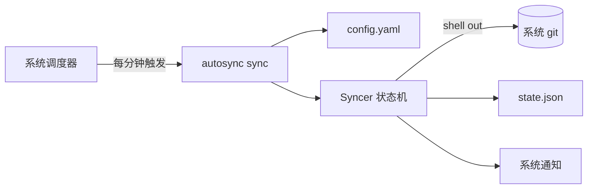

# AutoSync

> 基于系统 git 的跨平台文件夹双向同步工具。配置一次，定时轮询、自动提交、冲突自动处理，完全无感。

## 功能

- 双向同步：本地变更自动提交推送，远程新提交自动 rebase 合并。
- 冲突零丢失：三策略（`local_wins` 备份远程到分支 / `remote_wins` 重置 / `abort` 中止），强推用 `--force-with-lease`。
- 无感：成功静默，仅初始化 / 冲突 / 失败弹系统通知。
- 健壮：网络操作指数退避重试、单实例锁、备份分支自动清理。
- 调度自安装：`install` 注册系统定时任务（Windows schtasks）。
- dry-run 预览：只读输出同步计划，不联网不改仓库。

## 架构



单二进制 + 一个 YAML 配置，程序不常驻。Syncer 依赖 `GitOperator` 接口（依赖倒置），shell out 调系统 git 完成全部操作。详见 [docs/tech.md](docs/tech.md)。

## 使用

```bash
# 构建（需 Go 1.26+ 与系统 git）
make build        # Windows 双版本（控制台 + 静默）
make test         # 全部测试（真实 git，无 mock）

# 配置：复制模板并填写 repo_dir / remote_url
cp config.example.yaml config.yaml

# 运行
autosync                                # 单次同步（默认）
autosync --dry-run                      # 只读预览
autosync status                         # 查看上次同步状态
autosync install --config <path>        # 注册定时任务
autosync uninstall                      # 移除定时任务
```

配置字段与命令详见 [docs/api.md](docs/api.md)。

## 平台

| 平台 | 同步核心 | 调度自安装 |
|------|----------|-----------|
| Windows | ✅ | ✅ schtasks |
| macOS / Linux | ✅ | 手动 cron（自安装见 [TODO.md](docs/TODO.md)） |

## 文档

- [docs/prd.md](docs/prd.md) — 产品需求
- [docs/tech.md](docs/tech.md) — 系统设计
- [docs/api.md](docs/api.md) — 命令接口
- [docs/flow.md](docs/flow.md) — 业务流程
- [docs/TODO.md](docs/TODO.md) — 不足与方向

## 未来方向

- macOS / Linux 调度自安装（launchd / cron）
- daemon 模式与亚分钟级同步
- 多文件夹、HTTPS token 引导、连续失败降噪、托盘应用

完整路线见 [docs/TODO.md](docs/TODO.md)。
