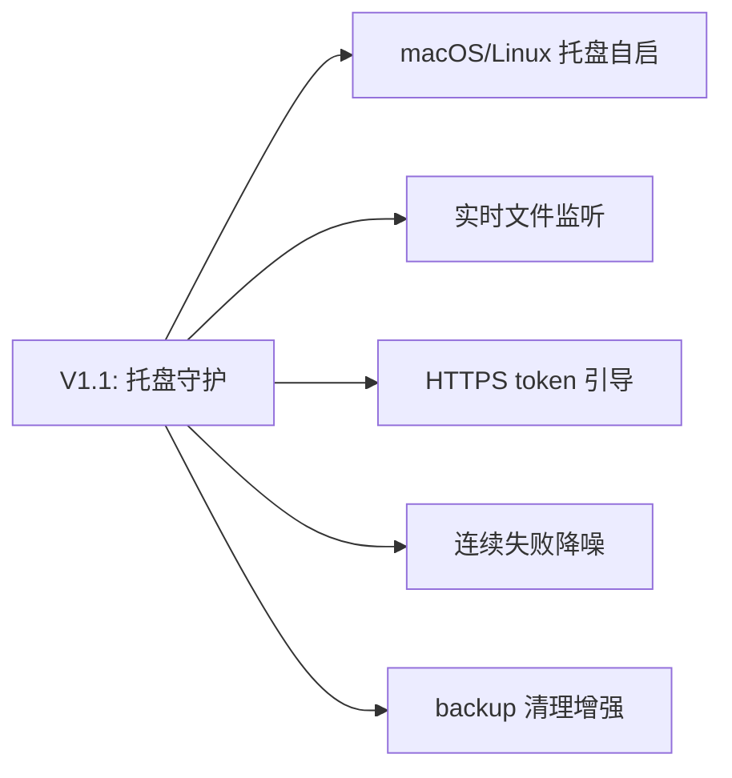

# TODO · 不足与方向

> 当前系统的已知不足、未来开发方向，以及代码内全量 TODO 清单。代码 ↔ 本文档双向校验。

## 当前不足

| 不足 | 影响 | 说明 |
|------|------|------|
| dry-run 不联网 | 预览可能误报 UpToDate | 跳过 fetch，基于陈旧远程引用判定，远程已领先时仍显示"一致" |
| local_wins 并发覆盖 | 多设备真并发时最后同步者覆盖 | 已知权衡；真并发场景建议改 `abort` 手动处理 |
| backup 清理无跨设备协调 | 一端清理了另一端未拉取的备份 | 清理仅按本地+远程引用，不感知其他设备是否已恢复 |
| Linux 调度未实现 | Linux 需手动配 cron | `install`/`uninstall` 在 Linux 返回未实现；macOS 已由 Swift 壳 SMAppService 管理 |
| 通知不分级 | 信息/警告/错误图标一致 | beeep 投递统一默认图标 |
| 连续失败无降噪 | 持续失败会重复通知 | `ConsecutiveFailures` 字段已预留未启用 |

## V1.1：托盘守护（已完成）

V1.1 将 CLI 一次性工具升级为托盘常驻守护应用（方案 A），代码已落地。详见 [plan.md](plan.md)。

- **托盘守护**：Fyne 托盘 + 配置窗口，内置 ticker 定时同步（取代 schtasks）。
- **多文件夹**：`autosync.conf.yaml` 多任务，每任务独立 state/lock。
- **开机自启**：注册表 Run 键（`install`/`uninstall` 新语义，托盘菜单可切换）。
- **右键手动同步 / 暂停**：托盘菜单对指定任务立即触发或暂停。
- **CLI 保留**：`sync`/`status` 供脚本/无头。
- **byproduct 集中**：配置/日志/状态/锁统一在 `~/.autosync/`，exe 位置独立。
- **自有图标**：托盘/窗口/exe 自有 SVG 图标。

## 后续方向

- **Linux 托盘自启**：cron 实现非 Windows 自启（macOS 已由 SMAppService 完成）。
- **实时文件监听**：inotify/FSEvents 替代轮询，亚分钟级延迟。
- **HTTPS token 引导**：降低 SSH 凭证配置门槛。
- **连续失败降噪**：启用 `ConsecutiveFailures`，指数退避告警。
- **backup 清理增强**：按时间过期、跨设备协调。
- **macOS 代码签名 + 公证**：取得 Developer ID 后用 notarytool 公证，移除 `xattr` 手动步骤。
- **macOS engine 崩溃重启策略**：壳侧指数退避最多 3 次，可配置化。

### 架构优化（审计延后）

- **抽取 `sync.Orchestrator`**：`runSync` 与 `TaskRunner.Run` 的 lock→gitignore→syncer→state→notify 编排重复，抽共享层。
- **gitop exec 超时 + 错误包装**：`execGit.run` 无超时（hung git 冻结 ticker/Reload/退出），改 `context.WithTimeout`；错误用 `%w` 包装。
- **Reload 非阻塞**：`TaskScheduler.Reload` 的 `Stop.wg.Wait` 阻塞 UI 线程，改 goroutine + `fyne.Do` 刷菜单。
- **RelationTo 破坏性回退**：merge-base 失败回退 `RelDiverged` 可能致 `local_wins` 覆盖无关远程，需显式处理。
- **log 格式化助手**：补 `Infof`/`Warnf`/`Errorf` 统一格式化风格（当前 Sprintf 与拼接混用）。
- **pidAlive 容错**：`tasklist` 不可用时回退 alive 致死锁无法恢复。

## 代码 TODO 清单

按业务合并。每条标注源文件与行号，便于双向追溯。

### 同步引擎

| 位置 | TODO |
|------|------|
| `internal/sync/syncer.go:206` | DryRun 可选 fetch 以预判远程领先（当前基于陈旧远程引用，可能误报 UpToDate） |
| `internal/sync/syncer.go:247` | 提交消息模板支持完整 Go 模板语法与更多变量（变更文件数等） |

### 通知与告警

| 位置 | TODO |
|------|------|
| `internal/notify/beeep.go:17` | 按 severity 区分通知图标（当前统一默认图标） |
| `internal/state/state.go:18` | 启用 `ConsecutiveFailures` 抑制重复通知与退避告警 |

## 一致性审计

双向校验：代码内 `// TODO:` 注释 ↔ 本文档清单。

- 代码 TODO 总数：**4**
- 本文档收录：**4**
- 校验方式：`git grep -n "TODO:" -- '*.go'` 输出与上表一一对应。
- 维护约定：新增 / 删除代码 TODO 须同步更新本文档；本文档条目须能在代码中定位。
