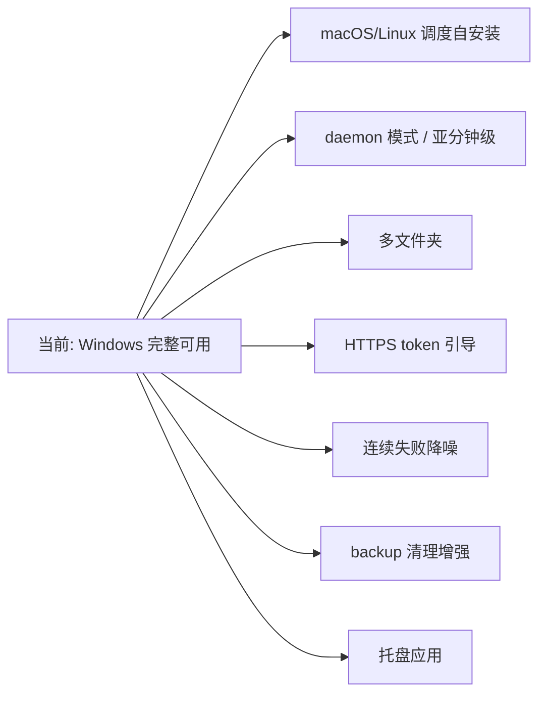

# TODO · 不足与方向

> 当前系统的已知不足、未来开发方向，以及代码内全量 TODO 清单。代码 ↔ 本文档双向校验。

## 当前不足

| 不足 | 影响 | 说明 |
|------|------|------|
| dry-run 不联网 | 预览可能误报 UpToDate | 跳过 fetch，基于陈旧远程引用判定，远程已领先时仍显示"一致" |
| local_wins 并发覆盖 | 多设备真并发时最后同步者覆盖 | 已知权衡；真并发场景建议改 `abort` 手动处理 |
| backup 清理无跨设备协调 | 一端清理了另一端未拉取的备份 | 清理仅按本地+远程引用，不感知其他设备是否已恢复 |
| 非 Windows 调度未实现 | macOS/Linux 需手动配 cron | `install`/`uninstall` 在非 Windows 返回未实现 |
| 通知不分级 | 信息/警告/错误图标一致 | beeep 投递统一默认图标 |
| 连续失败无降噪 | 持续失败会重复通知 | `ConsecutiveFailures` 字段已预留未启用 |

## 未来方向

- **macOS/Linux 调度自安装**：launchd plist / cron 实现 `Scheduler.Install`。
- **daemon 模式**：内置 ticker 长驻，支持亚分钟级间隔与实时性。
- **多文件夹**：单进程多任务或多实例配置管理。
- **HTTPS token 引导**：降低 SSH 凭证配置门槛。
- **连续失败降噪**：启用 `ConsecutiveFailures`，指数退避告警。
- **backup 清理增强**：按时间过期、跨设备协调。
- **托盘应用**：常驻托盘 + 状态可视化。

## 代码 TODO 清单

按业务合并。每条标注源文件与行号，便于双向追溯。

### 同步引擎

| 位置 | TODO |
|------|------|
| `internal/sync/syncer.go:206` | DryRun 可选 fetch 以预判远程领先（当前基于陈旧远程引用，可能误报 UpToDate） |
| `internal/sync/syncer.go:247` | 提交消息模板支持完整 Go 模板语法与更多变量（变更文件数等） |

### 通知与告警

| 位置 | TODO |
|------|------|
| `internal/notify/beeep.go:17` | 按 severity 区分通知图标（当前统一默认图标） |
| `internal/state/state.go:18` | 启用 `ConsecutiveFailures` 抑制重复通知与退避告警 |

### 跨平台调度

| 位置 | TODO |
|------|------|
| `internal/sched/sched_other.go:9` | 实现 launchd（macOS）/ cron（Linux）调度自安装 |

### 配置与多实例

| 位置 | TODO |
|------|------|
| `internal/config/config.go:172` | 配置路径支持 HOME / 系统配置目录（多实例场景） |

## 一致性审计

双向校验：代码内 `// TODO:` 注释 ↔ 本文档清单。

- 代码 TODO 总数：**6**
- 本文档收录：**6**
- 校验方式：`git grep -n "TODO:" -- '*.go'` 输出与上表一一对应。
- 维护约定：新增 / 删除代码 TODO 须同步更新本文档；本文档条目须能在代码中定位。
