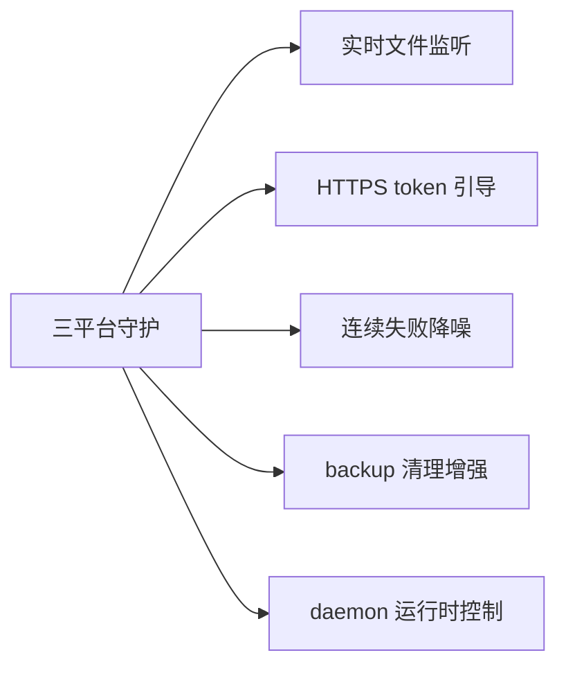

# TODO · 不足与方向

> 当前系统的已知不足、未来开发方向，以及代码内全量 TODO 清单。代码 ↔ 本文档双向校验。产品方向与商业化节奏见 [roadmap.md](roadmap.md)，本文聚焦技术层。

## 当前不足

| 不足 | 影响 | 说明 |
|------|------|------|
| dry-run 不联网 | 预览可能误报 UpToDate | 跳过 fetch，基于陈旧远程引用判定，远程已领先时仍显示"一致" |
| local_wins 并发覆盖 | 多设备真并发时最后同步者覆盖 | 已知权衡；真并发场景建议改 `conflict_files` 保留副本或手动处理 |
| backup 清理无跨设备协调 | 一端清理了另一端未拉取的备份 | 清理仅按本地+远程引用，不感知其他设备是否已恢复 |
| daemon 无运行时控制 IPC | Linux daemon 不能手动同步/暂停 | 不像 Win 托盘/macOS 壳有菜单；暂靠 `autosync sync` 单次 + 编辑配置重启 daemon |
| 通知不分级 | 信息/警告/错误图标一致 | beeep 投递统一默认图标 |
| 连续失败无降噪 | 持续失败会重复通知 | 未实现累计失败抑制 |
| 文档漂移 | 配置字段/默认值与实现不符 | api.md 声称 `log_file`/`state_file`/旧单配置兼容/interval 最小 1m 均未实现；锁与状态文件名与文档不一致 |
| 状态文件非原子写 | 崩溃可能写坏状态 | `state.Save` 直接 `os.WriteFile`，守护与 CLI 并发读写可能读到半写 JSON |
| 双配置并存 | CLI 与托盘配置分离，`status` 只读 default | `config.yaml` 与 `autosync.conf.yaml` 同机并存，`autosync status` 对多任务无效 |
| interval 无下限 | 可配毫秒级忙轮询 | 文档声称最小 1 分钟，`validate` 未落地 |
| 托盘自启不携带 `--config` | 自启加载默认配置 | 托盘菜单自启开关不传当前实例配置路径 |
| engine Scanner 64KB 上限 | 大配置 JSON 超限静默退出 | `config-save` 单行超 64KB 时主循环退出且无 bye |
| YAML 未知字段静默忽略 | 拼错字段名无提示 | `yaml.Unmarshal` 无 KnownFields 约束 |
| gitignore 追加非原子 | 崩溃残留半行条目 | `Ensure` 逐条 O_APPEND 追加 |

## 后续方向

- **实时文件监听**：inotify/FSEvents 替代轮询，亚分钟级延迟。
- **HTTPS token 引导**：降低 SSH 凭证配置门槛。
- **连续失败降噪**：启用 `ConsecutiveFailures`，指数退避告警。
- **backup 清理增强**：按时间过期、跨设备协调。
- **macOS 代码签名 + 公证**：取得 Developer ID 后用 notarytool 公证，移除 `xattr` 手动步骤。
- **macOS engine 崩溃重启策略**：壳侧指数退避最多 3 次，可配置化。
- **daemon 运行时控制**：Linux daemon 加 SIGHUP Reload 或 Unix socket，支持手动同步/暂停（对齐 Win/macOS 菜单能力）。

### 架构优化（审计延后）

- **抽取 `sync.Orchestrator`**：`runSync` 与 `TaskRunner.Run` 的 lock→gitignore→syncer→state→notify 编排重复，抽共享层。
- **Reload 非阻塞**：`TaskScheduler.Reload` 的 `Stop.wg.Wait` 阻塞 UI 线程，改 goroutine + `fyne.Do` 刷菜单。
- **RelationTo 破坏性回退**：merge-base 失败回退 `RelDiverged` 可能致 `local_wins` 覆盖无关远程，需显式处理。
- **log 格式化助手**：补 `Infof`/`Warnf`/`Errorf` 统一格式化风格（当前 Sprintf 与拼接混用）。
- **pidAlive 容错**：`tasklist` 不可用时回退 alive 致死锁无法恢复。

## 代码 TODO 清单

按业务合并。每条标注源文件与行号，便于双向追溯。

### 同步引擎

| 位置 | TODO |
|------|------|
| `internal/sync/syncer.go:290` | DryRun 可选 fetch 以预判远程领先（当前基于陈旧远程引用，可能误报 UpToDate） |
| `internal/sync/syncer.go:331` | 提交消息模板支持完整 Go 模板语法与更多变量（变更文件数等） |

### 通知与告警

| 位置 | TODO |
|------|------|
| `internal/notify/beeep.go:17` | 按 severity 区分通知图标（当前统一默认图标） |

## 一致性审计

双向校验：代码内 `// TODO:` 注释 ↔ 本文档清单。

- 代码 TODO 总数：**3**
- 本文档收录：**3**
- 校验方式：`git grep -n "TODO:" -- '*.go'` 输出与上表一一对应。
- 维护约定：新增 / 删除代码 TODO 须同步更新本文档；本文档条目须能在代码中定位。
