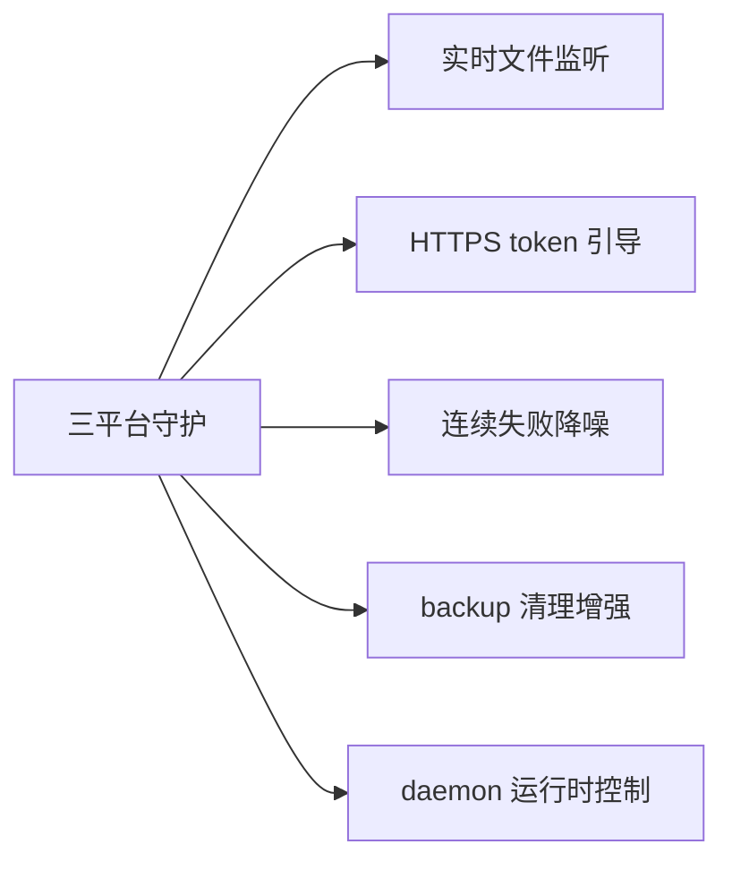

# TODO · 不足与方向

> 当前系统的已知不足、未来开发方向，以及代码内全量 TODO 清单。代码 ↔ 本文档双向校验。产品方向与商业化节奏见 [roadmap.md](roadmap.md)，本文聚焦技术层。

## 当前不足

| 不足 | 影响 | 说明 |
|------|------|------|
| dry-run 不联网 | 预览可能误报 UpToDate | 跳过 fetch，基于陈旧远程引用判定，远程已领先时仍显示"一致" |
| local_wins 并发覆盖 | 多设备真并发时最后同步者覆盖 | 已知权衡；真并发场景建议改 `conflict_files` 保留副本或手动处理 |
| backup 清理无跨设备协调 | 一端清理了另一端未拉取的备份 | 清理仅按本地+远程引用，不感知其他设备是否已恢复 |
| daemon 无运行时控制 IPC | Linux daemon 不能手动同步/暂停 | 不像 Win 托盘/macOS 壳有菜单；暂靠 `autosync sync` 单次 + 编辑配置重启 daemon |
| 通知不分级 | 信息/警告/错误图标一致 | beeep 投递统一默认图标 |
| 连续失败无降噪 | 持续失败会重复通知 | 未实现累计失败抑制 |

## 后续方向

- **实时文件监听**：inotify/FSEvents 替代轮询，亚分钟级延迟。
- **HTTPS token 引导**：降低 SSH 凭证配置门槛。
- **连续失败降噪**：启用 `ConsecutiveFailures`，指数退避告警。
- **backup 清理增强**：按时间过期、跨设备协调。
- **macOS 代码签名 + 公证**：取得 Developer ID 后用 notarytool 公证，移除 `xattr` 手动步骤。
- **macOS engine 崩溃重启策略**：壳侧指数退避最多 3 次，可配置化。
- **daemon 运行时控制**：Linux daemon 加 SIGHUP Reload 或 Unix socket，支持手动同步/暂停（对齐 Win/macOS 菜单能力）。

### 架构优化（审计延后）

- **抽取 `sync.Orchestrator`**：`runSync` 与 `TaskRunner.Run` 的 lock→gitignore→syncer→state→notify 编排重复，抽共享层。

## 深度审计改进清单（2026-08-08 全量审计）

> 里程碑之外的改进机会（已剔除 roadmap v1.3/v1.4/v2.0 内项），按优先级分组。优先级 = 数据安全/正确性 > 并发/生命周期 > 构建/CI/文档 > 测试缺口 > 低风险整洁。

### P0 · 数据一致性与正确性

| 位置 | 问题 |
|------|------|
| `gitop.go:406` | `NormalizeRemoteURL` 误判端口：`ssh://host:2222/path` 剥 scheme/`@` 后被拼成 `host/2222/path`，非默认端口远程与 `https://host/path` 恒不等 → 合法配置误报"不一致"。修：仅对无 scheme 的 scp 简写做 `:`→`/`，先剥离 `:port` |
| `syncer.go:243-250` | conflict_files 非 ASCII/特殊字符文件名丢数据：git core.quotePath 输出八进制转义，`os.ReadFile` 读转义串必失败 → reset 后本地版丢失。修：DiffNameOnly 改 `-z` NUL 分隔 |
| `syncer.go:244` | conflict_files 整文件载入内存，GB 级文件 OOM。修：设大小上限 / 流式拷贝，超限跳过并告警 |
| `gitop.go:294-297` | `RebaseAbort` 吞错：abort 失败残留 rebase 状态，后续 reset/branch 在畸形状态执行。修：确认进行中后检查 abort 错误并上报 |
| `tasksched.go:64-74` | 任务锁被占返回 `OutcomeNoChanges` + 静默，status 误报"无变更"。修：新增 `OutcomeSkipped`，不改状态不通知 |
| `configstore.go:227-229` | `migrateByproducts` 目标 state 已存在时 Rename 失败被忽略（Windows 报错）→ 旧 state 残留 / 新数据丢。修：先 Remove 目标再 Rename 并检查错误 |
| `gitop.go:377-389` | `DiffNameOnly` 注释方向反（A=远程独有、D=本地独有），A 类远程文件读本地必失败产生假告警。修：收敛 `--diff-filter=DM` 并修正注释 |
| `gitop.go:166-171` | `HasHead` 把损坏仓库当 unborn，误走对齐远程流程。修：区分 rev-parse 失败原因 |

### P1 · 并发 / 生命周期 / IPC

| 位置 | 问题 |
|------|------|
| `engine.go:64-76` | `sc.Err()` 未检查：超长行 ErrTooLong 静默退出无 bye，Swift 壳悬挂。修：循环后检查 Err，出错发 bye/error |
| `engine.go:75` | stdin EOF（壳直接关闭）不发 bye，壳误判崩溃。修：EOF 发 bye(reason=EOF) |
| `engine.go:184-192` | `buildStatusFromTask` 不读 state.Paused，config-saved/status 恒报 paused=false。修：补读 Paused |
| `engine.go:81-201` | sync-now 在命令循环内同步执行，长同步阻塞 quit/pause。修：RunNow 异步 + 回事件 |
| `engine.go:218-231` | evCh 满时 quit 的 bye 可能被丢弃而永不达。修：quit 走专用通道 |
| `tasksched.go:163-168` | 运行中触发 tick 阻塞在 `r.mu`，锁释放后冗余再跑。修：tick 用进行中标志跳过 |
| `tasksched.go:196-202` | `RunNow` 持旧 runner 指针（并发 Reload 后同步旧配置）。修：epoch 校验 |
| `lock.go:102-104` | `release` 无归属校验：接管后原持有者删新锁 → 并发写。修：删前比对锁内 PID |
| `lock.go:61` | `tryCreate` 忽略 Fprintf/Close 错误：半写锁被误判。修：检查写错误 |
| `engine.go:46/235-254` | `writeLoop` 永不退出，in-process 测试 goroutine 泄漏。修：Run 返回时关闭通道 |
| `run_daemon.go:49-51` | 二次信号未强制退出。修：第二次信号 os.Exit |
| `tasksched.go:56-60` | `Paused()` 用 Lock 非 RLock |
| `configstore.go:140-161` | `List/Get` 返回内部指针可外部变更（Ignore 切片共享）。修：深拷贝 |
| `configstore.go:234-268` | `Delete`/`ReplaceAll` 不清孤儿 byproduct（state/lock 残留）。修：删除后清理 |
| `configstore.go:272-299` | `Save` 无 fsync 即 rename，崩溃丢配置。修：写后 Sync |
| `tray_fyne.go:194-198` | editTask `*t=*existing` 浅拷贝共享 Ignore 切片。修：拷贝切片 |
| `main.go:53-61` | `parseCommand` 不识别 `-h/-v/--version`，落入托盘守护。修：分发前处理 |
| `main.go:74` | `setupTrayEnv` 恒 console=false，CLI sync 忽略任务 ShowConsole。修：按任务配置决定 |

### P2 · 构建 / CI / 打包 / 文档

| 位置 | 问题 |
|------|------|
| `.github/workflows` | 无 Windows CI：托盘（CGO+traygui+windowsgui）、pidalive_windows、autostart_windows、tasklist 超时从未编译/测试。修：加 windows-latest job |
| `.github/workflows/macos-swift.yml` | 只 lipo+xcodebuild 编译，不跑 darwin vet/test。修：补 darwin test job |
| `main.go` runInstall | `install` 不校验托盘可用性：build-cli（tray stub）下写坏自启项。修：Enable 前校验 |
| `macos/README-install.md:26` | 卸载目录错误（App Support vs 实际 `~/.autosync/`），删除指令漏删数据。修：改 `rm -rf ~/.autosync` |
| `Makefile:28` | build/build-cli 用 `-H windowsgui`，非 Windows 下 linker 报错，README 未标注仅限 Windows |
| `.github/workflows/linux.yml` | tarball 仅 amd64，未对齐 Makefile 双架构 |
| `.github/workflows` | CI 缺 traygui 标签的 vet/build（tray_fyne.go 永不进 CI） |
| `Makefile:32` | build-cli 产物 `AutoSync-CLI.exe` 跨平台名不副实。修：按 GOOS 命名 |
| `engine.go:24` / `macos/project.yml:15` / `macos/build-dmg.sh:8` | 版本号 1.2.0 三处硬编码。修：集中单一来源 |
| `scripts/install-linux.sh:10` | CWD 假设脆弱 + 覆盖运行中 daemon 二进制。修：SCRIPT_DIR 定位 + 提示先停服务 |
| `.gitignore:16` | `config.yaml` 规则残留（config.yaml 已删） |

### P3 · 测试缺口 / 可靠性

| 位置 | 问题 |
|------|------|
| `test/sync_test.go` | dry-run 覆盖不足：init/无HEAD/远程不一致/RemoteAhead/Diverged/LocalAhead 分支全未测。修：表驱动 |
| `test/sync_test.go` | conflict_files 的 Deleted(D) 分支未测；remote_wins 未断言 `clean -fd` |
| `test/sync_test.go` / `flow.md` | Fetch 失败→NoChanges 降级路径未测，flow.md 状态机也未画该路径 |
| `configstore.go:152` / `tasksched.go:219` | `Get`/`runnerByName` 按原文匹配、判重按 safeName：任务名 "a b"（safeName a_b）CLI sync/RunNow 查不到。修：查找统一 safeName |
| `test/tasksched_test.go` | 时序敏感测试易 flaky（固定 sleep 300ms / 轮询 2-3s）。修：放大窗口或事件通道 |
| `test/engine_test.go:35` | engineBinOnce 临时目录不清理；全局 AUTOSYNC_DATA_DIR 与 t.Setenv 混用禁并行。修：t.Cleanup |
| `test/retry_test.go` | 未测 count<1 钳制与指数退避边界 |

### P4 · 低风险整洁

| 位置 | 问题 |
|------|------|
| `config/paths.go:46-53` | StateFilePath/LockFilePath 缺防御式清理（name 含 `../` 可写越界） |
| `config/config.go:58-63` | backup_keep/retry_count 用 `==0` 判定，无法显式设 0 |
| `state/state.go:85` | Rename 失败无重试 + 临时文件无 fsync |
| `gitop/retry.go:52-74` | PullRebase（网络）未纳入重试，而 PushForce/PushBranch 反而重试——明确取舍或补 PullRebase |
| `gitignore/gitignore.go:15-49` | 读快照与追加间 TOCTOU 可能重复追加；不识 `!` 否定条目 |
| `autostart_linux.go:66-80` | Disable 全吞 systemctl 错误；IsEnabled 每次 spawn 进程 |
| `configstore.go:124-137` | macOS 大小写不敏感文件系统未 lower，与 Windows 不一致 |
| `log/log.go:47-49` | 控制台走 stdout + 写文件错误忽略 + 无日志轮转 |
| `gitop/gitop.go:416-422` | truncate 按字节截断 UTF-8 出现乱码 |
| `gitop/gitop.go:150-156` | Init 的 remoteURL 以 `-` 开头被 git 当选项。修：参数前 `--` |
| `gitop/gitop.go:121/131` | 超时挂起时孙子进程持句柄，临时文件泄漏系统 tmp；ReadFile 吞读错误 |
| 架构 | 锁仅单机语义：多设备同步同一远程时冲突 push 会竞争。修：文档明示或加远程锁 |
| `sync/syncer.go:167` | 未知 relation 死代码分支；`gitop.DiffNameOnly` 与 conflictFiles 职责耦合 |

## 代码 TODO 清单

按业务合并。每条标注源文件与行号，便于双向追溯。

### 同步引擎

| 位置 | TODO |
|------|------|
| `internal/sync/syncer.go:343` | DryRun 可选 fetch 以预判远程领先（当前基于陈旧远程引用，可能误报 UpToDate） |
| `internal/sync/syncer.go:407` | 提交消息模板支持完整 Go 模板语法与更多变量（变更文件数等） |

### 通知与告警

| 位置 | TODO |
|------|------|
| `internal/notify/beeep.go:17` | 按 severity 区分通知图标（当前统一默认图标） |

## 一致性审计

双向校验：代码内 `// TODO:` 注释 ↔ 本文档清单。

- 代码 TODO 总数：**3**
- 本文档收录：**3**
- 校验方式：`git grep -n "TODO:" -- '*.go'` 输出与上表一一对应。
- 维护约定：新增 / 删除代码 TODO 须同步更新本文档；本文档条目须能在代码中定位。
