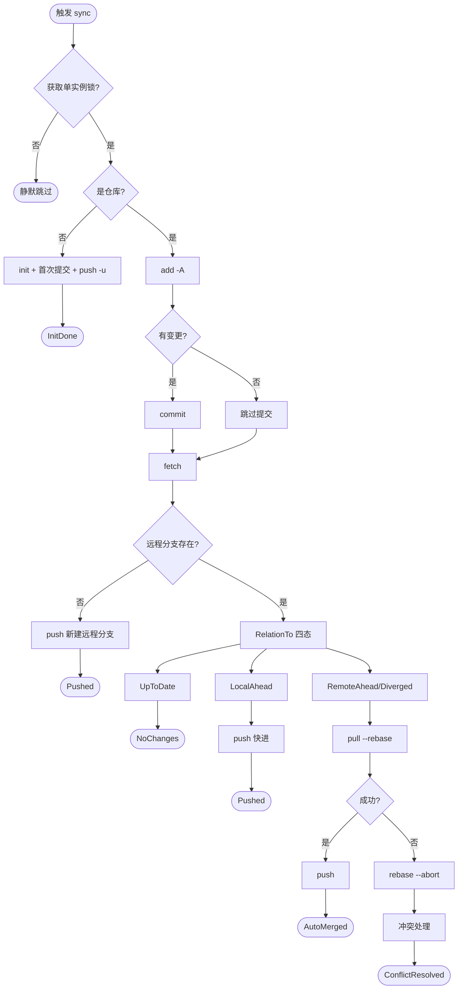
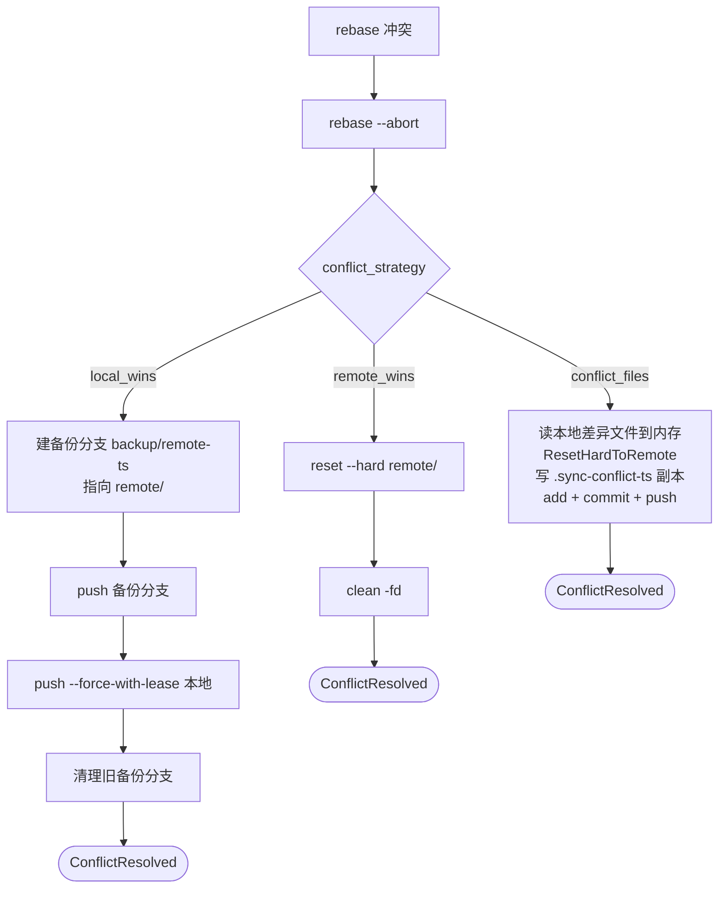
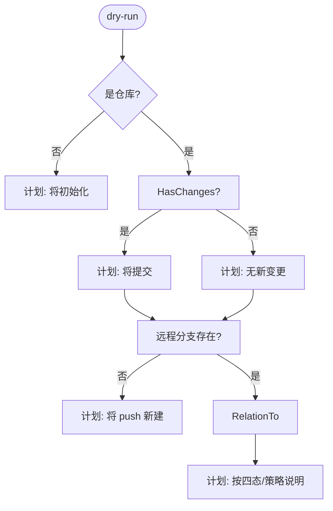
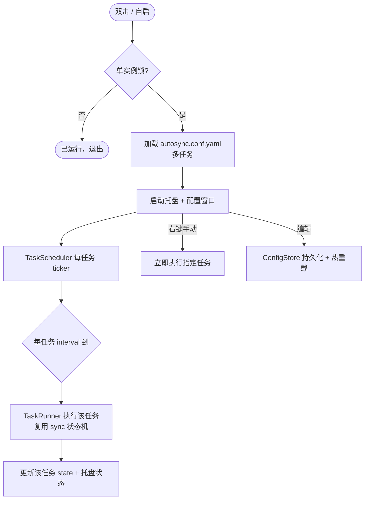

# FLOW · 业务流程

> 各业务流程的 mermaid 图与数据流描述。架构与接口见 [tech.md](tech.md)，命令见 [api.md](api.md)。

## 同步主状态机

**数据流**

1. **加锁**：`O_EXCL` 创建 `autosync.lock` 写 PID；失败则读 PID 判断持有进程存活，存活跳过，已死接管。
2. **初始化**：`git init -b <branch>` → `remote add` → `add -A` → `commit --allow-empty` → `push -u`。
3. **提交**：`git add -A` → `git status --porcelain` 判变更 → `git commit -m "<模板>"`。
4. **拉取引用**：`git fetch <remote>`（重试装饰器包裹）。
5. **关系判定**：`rev-parse HEAD` 与 `<remote>/<branch>` 比较；不等则 `merge-base` 定四态。
6. **合并**：`git pull --rebase <remote> <branch>`；失败 `git rebase --abort` 后转冲突处理。
7. **推送**：`git push` 或 `git push --force-with-lease`（重试包裹）。
8. **收尾**：写 `autosync.state.json` → 按结果通知 → 释放锁。

## 冲突处理

**数据流**

- **local_wins**：`git branch backup/remote-<ts> <remote>/<branch>` → `git push <remote> backup/remote-<ts>` → `git push --force-with-lease <remote> <branch>` → 列 `backup/remote-*` 按名降序留最新 `backup_keep` 个，余下本地 `-D` + 远程 `--delete`。远程旧版本保存在备份分支可 checkout 恢复。
- **remote_wins**：`git reset --hard <remote>/<branch>` → `git clean -fd`。本地未推送改动丢弃。
- **conflict_files**：`git diff --name-only --diff-filter=MD HEAD <remote>/<branch>` 列差异文件 → `os.ReadFile` 读本地版到内存 → `git reset --hard <remote>/<branch>` + `git clean -fd`（副本未写入，不受影响）→ 写 `<file>.sync-conflict-<ts>.<ext>` 副本 → `git add -A` + `commit` + `push`。本地版以副本入 git 同步所有设备，远程版为主文件。

## dry-run

**数据流**：仅 `status --porcelain` / `rev-parse` / `merge-base` 等读命令，跳过 `fetch` 与所有写操作。基于本地陈旧远程引用判定，可能误报 UpToDate（见 TODO）。不写状态、不加锁、不通知。

## 备份清理

`ListBackupBranches` 收集本地 `refs/heads/backup/remote-*` 与远程 `refs/remotes/<remote>/backup/remote-*`，去远程前缀合并去重；按分支名内时间戳降序排序，保留前 `backup_keep` 个，其余 `branch -D`（本地）+ `push --delete`（远程）。

## 托盘守护流程

**数据流**

- **启动**：`autosync.conf.yaml` 加载任务列表 → 每任务按 interval 起 ticker → 到点调 TaskRunner → TaskRunner 构造 Syncer 执行同步状态机（见上）→ 结果写该任务 state + 通知 + 回显托盘。
- **手动同步**：托盘菜单选任务 → 立即调 TaskRunner（与定时同路径，单实例锁保护单仓库不并发）。
- **配置变更**：窗口编辑 → 保存 `autosync.conf.yaml` → 热重载该任务 ticker（无需重启）。
- **自启**：注册表 Run 键 → 登录后系统拉起 `autosync`（无参数）→ 托盘守护。
