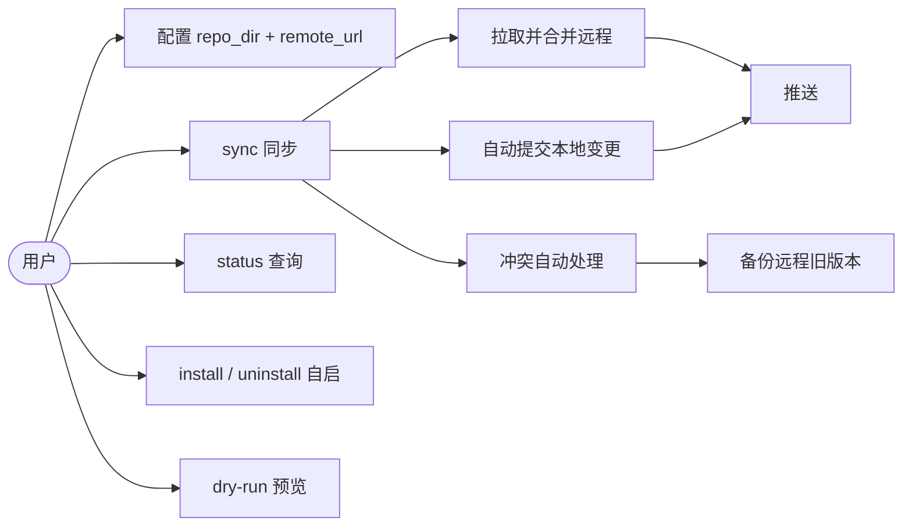
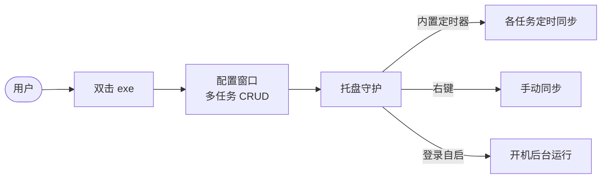
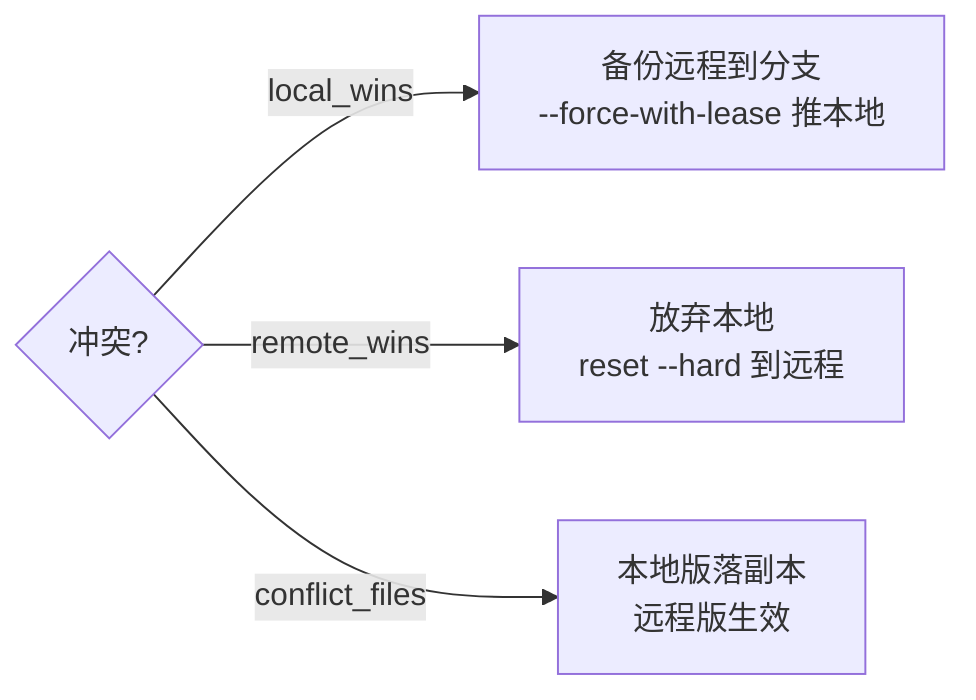

# PRD · 产品需求

> AutoSync：基于系统 git 的跨平台文件夹双向同步工具。配置一次，定时轮询、自动提交、冲突自动处理，完全无感。

## 定位

单二进制 + 用户目录配置（`~/.autosync/`），双击启动托盘守护，后台定时同步；CLI 一次性命令保留供脚本 / 无头。把指定本地文件夹与一个 git 远程仓库保持双向一致。

## 核心目标

- **简洁**：无 Web、无数据库、无外部服务依赖。
- **无感**：成功静默；仅初始化 / 冲突 / 失败弹系统通知。
- **零丢失**：冲突时远程旧版本备份到分支，可随时恢复。

## 能力图

## 用户故事

| 编号 | 故事 | 验收 |
|------|------|------|
| US-01 | 首次运行自动初始化仓库并推送 | 空目录 → `git init` + 首次提交 + push |
| US-02 | 本地变更自动提交并推送 | 新增 / 修改文件 → 自动 commit + push |
| US-03 | 远程新提交自动拉取合并 | 其他设备推送 → rebase 合并，本地得到新文件 |
| US-04 | 冲突自动处理且零丢失 | 三策略；local_wins 备份远程到分支可恢复 |
| US-05 | 备份分支自动清理 | 保留最新 N 个，超出自动删除 |
| US-06 | 同步状态可查 | `status` 显示上次同步时间 / 结果 / 备份分支 |
| US-07 | 成功无感，异常通知 | 成功静默；冲突 / 失败弹通知 |
| US-08 | 开机自启 | `install` 注册开机自启，`uninstall` 移除 |
| US-09 | dry-run 预览 | 输出计划，不联网不改仓库 |
| US-10 | .gitignore 自动维护 | 仅追加缺失条目，不覆盖既有配置 |

## 功能需求

- FR-1 `sync` 执行：init → commit → fetch → 关系判定 → push / rebase / 冲突处理。
- FR-2 关系四态判定（UpToDate / LocalAhead / RemoteAhead / Diverged），正确路由推送与合并。
- FR-3 冲突三策略：`local_wins`（备份 + `--force-with-lease`）/ `remote_wins`（reset --hard）/ `conflict_files`（本地版落副本，远程版生效）。
- FR-4 备份分支 `backup/remote-<时间戳>`，按名排序保留最新 `backup_keep` 个。
- FR-5 强制推送一律 `--force-with-lease`，禁止裸 `--force`。
- FR-6 网络操作指数退避重试（`retry_count` / `retry_base_delay`）。
- FR-7 单实例锁，并发实例静默跳过。
- FR-8 `status` 持久化并展示上次同步结果。
- FR-9 通知策略：成功静默，InitDone 信息，冲突警告，失败错误。
- FR-10 `install` / `uninstall` 开关开机自启（Windows 注册表 `Run` 键 / Linux systemd / macOS 壳 SMAppService）。
- FR-11 `--dry-run` 只读输出同步计划。
- FR-12 `.gitignore` 追加式维护。

## 托盘守护

双击 exe 启动**托盘常驻守护进程**：弹配置窗口，后台托盘定时同步，右键手动同步，支持多文件夹。CLI 保留供脚本/无头。

| 编号 | 故事 | 验收 |
|------|------|------|
| US-11 | 双击 exe 启动托盘 | 无参数 → 托盘图标 + 配置窗口 |
| US-12 | GUI 配置多任务 | 窗口内增删改多份同步任务，持久化 |
| US-13 | 托盘后台定时同步 | 守护进程按各任务 interval 自动同步 |
| US-14 | 右键手动同步 | 托盘菜单对指定任务立即触发同步 |
| US-15 | 开机自启 | install 注册开机自启，登录后自动守护运行 |

## 非目标

实时文件监听（inotify/FSEvents）、应用内凭证管理、实时双向推送。详见 [TODO.md](TODO.md)。

## 冲突策略

