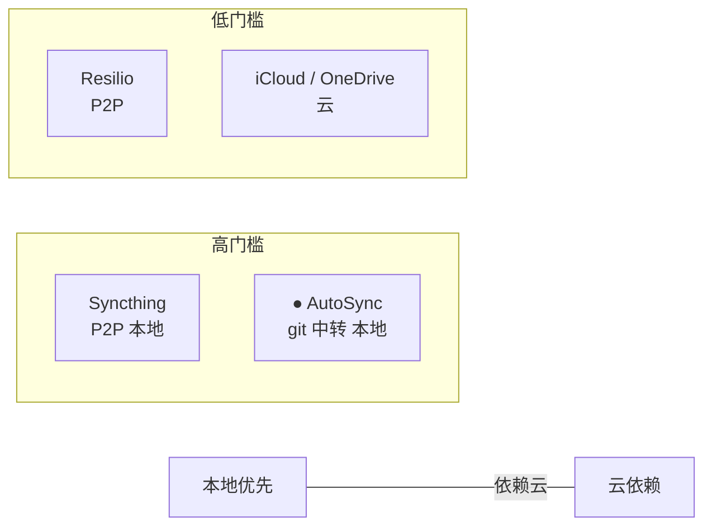
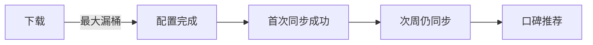
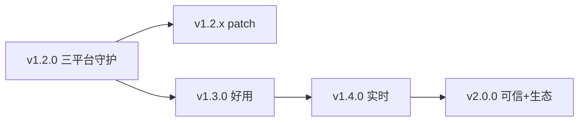
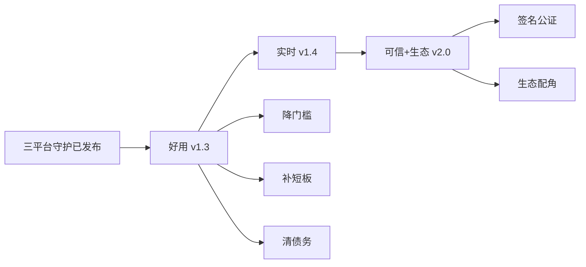

# ROADMAP · 产品方向

> 产品视角的方向与节奏：定位、北极星、验证闭环、商业化。技术不足与代码 TODO 见 [TODO.md](TODO.md)，两者互补——本文回答"为谁做、做不做、怎么验证、怎么活下来"，TODO 回答"代码哪里还不够稳"。

## 定位

"基于 git 同步"是架构，不是被雇理由。用户雇 AutoSync 完成的任务是：

> 在多台电脑间无缝继续工作，且不丢任何改动，且不被云盘绑架。

价值主张（省 / 赚 / 避免）：

- **省**：手动 git 操作时间 + 云盘订阅费
- **赚**：不丢改动，避免重写代码 / 文档的返工
- **避免**：云盘锁定与隐私问题 + 冲突覆盖丢数据

强定位：**在多台电脑写代码 / 笔记的开发者，解决"忘记 push / pull 就丢改动或冲突覆盖"，因为 AutoSync 自动双向同步且冲突保留副本可恢复。**

记忆点是"冲突副本可恢复"——这是竞品（iCloud / OneDrive / Syncthing）不好复制的组合：git 版本回溯 + 冲突零丢失 + 本地优先。"git 中转"本身不是护城河，大厂看不上这个垂直组合才是。

## 竞品坐标

空档在"本地优先 + 傻瓜化"，但 AutoSync 现落点在极客象限。按"先小后大"原则，先深扎极客象限（开发者天然主场，git 门槛对这群人其实低于"配置远程仓库"这一步），跑通留存再考虑降低门槛。

## 北极星

**周活跃同步成功的用户数**——同步成功才是价值发生，不是下载量，不是 GitHub stars。

AARRR 漏斗预判最大漏水层在**激活**：用户下载后配置远程仓库有门槛，配置失败即流失。所以先修激活，再谈拉新。

## 方向决策

### 人群：深扎跨设备开发者

"走 git 中转"天然把用户切窄到懂 git 的人——这不是缺点，是定位利器，自动完成"先小后大"第一步。不要扩到"所有要同步文件夹的人"，那是 iCloud 主场。

TAM-SAM-SOM 粗估：SAM（懂技术 + 有 GitHub 账号 + 重视隐私 / 版本回溯）≈ 500 万人；SOM 第一年（中文开发者社区 + 重度跨设备工作流）≈ 5 万 × 3% × 100 元 ≈ 15 万。够独立开发者活，不必追大市场。

### 价值：冲突零丢失为记忆点

三策略里 `conflict_files`（本地版落副本、远程版生效、副本入 git 跨设备可见）是差异化口碑点。Kano 分类：

- **基础型**（必须做齐）：双向同步、冲突不丢数据、守护稳定、配置一次持久化
- **期望型**（按 RICE 排）：同步速度、多仓库、状态可视化
- **兴奋型**（口碑）：冲突副本可视化回溯、自动恢复旧版本

### 商业：全程开源

AutoSync 全程 MIT 开源，不设功能付费墙——`conflict_files` 等所有能力均开源可用。商业化不靠截留功能，靠口碑积攒后的赞助与企业支持。参照 Syncthing / Rclone 等开源同步工具：全开源免费靠捐赠 + 社区维护存活。AutoSync 无服务器、无 API 成本，运营开支接近 0，赞助即可覆盖——不必为变现截留功能。

| 通道 | 形态 | 触发时机 |
|------|------|----------|
| 赞助 | GitHub Sponsors / 一次性 / 月度 | 口碑积累后挂赞助入口 |
| 企业支持 | 付费咨询 / 定制 / SLA | 有企业用户主动询盘 |
| 托管服务 | （谨慎）git 仓库中转托管 | 与"不搭服务器"定位有张力，仅作远期可选 |

## 版本规划

语义化版本（SemVer），赋予产品语义：MAJOR = 产品形态跃迁，MINOR = 新功能向后兼容，PATCH = bug 修复不加功能。每版本一个主题，不堆功能。

### v1.2.0 · 三平台守护（已发布 2026-07-28）

Windows 托盘 + macOS Swift 壳 + Linux systemd daemon，三冲突策略（含 `conflict_files` 副本入 git）。**v1.2.x** 仅修 bug 不加功能。

### v1.3.0 · 好用（体验完善 + 清债）

降激活门槛、补通知短板、清架构债。技术不足与代码 TODO 见 [TODO.md](TODO.md)。

| 功能 | 类型 |
|------|------|
| HTTPS token 引导（降配置门槛，免配 SSH） | 激活 |
| 连续失败降噪（ConsecutiveFailures 抑制刷屏） | 体验 |
| 通知分级图标（severity 透传 beeep） | 体验 |
| DryRun 可选 fetch（预判远程领先） | 体验 |
| 提交消息模板增强（文件数等变量） | 体验 |
| gitop exec 超时 + 错误包装 | 架构债 |
| 抽 sync.Orchestrator（去 runSync 重复编排） | 架构债 |
| Reload 非阻塞（TaskScheduler 不卡 UI） | 架构债 |

### v1.4.0 · 实时（同步模式升级）

从定时轮询到事件驱动；Linux daemon 补运行时控制，对齐 Win/macOS 菜单能力。

| 功能 | 类型 |
|------|------|
| 实时文件监听（inotify / FSEvents / ReadDirectoryChanges） | 核心 |
| daemon 运行时控制 IPC（SIGHUP Reload / Unix socket） | 平台补齐 |
| backup 清理增强（按时间过期 + 跨设备协调） | 健壮性 |
| RelationTo 破坏性回退处理 | 架构债 |

### v2.0.0 · 可信 + 生态（产品成熟）

从"工具"到"可信工具 + 生态配角"。三平台签名可信 + 集成开发者工具链——产品形态跃迁，升 MAJOR。

| 功能 | 类型 |
|------|------|
| macOS 代码签名 + 公证（notarytool，移除 xattr 手动步骤） | 信任 |
| macOS engine 崩溃重启策略（指数退避可配置） | 健壮性 |
| 生态集成：VS Code / Obsidian 插件（同步状态可见） | 生态 |
| Git hook 集成 | 生态 |

### 不做（除非明确要求）

P2P 设备发现、文件分享链接、端到端加密云盘化、手机端、团队协作双边网络——竞品主场，做了变瑞士军刀失去记忆点。硬凑 AI（预测冲突 / 自动分类）为伪需求，AutoSync 非 AI 产品。

## 分阶段路线

版本规划是按版本号递进的交付节奏；下面是按产品阶段的能力侧重，两者经纬互补——版本管"何时发"，阶段管"为何做"。

| 阶段 | 对应版本 | 侧重 |
|------|----------|------|
| 好用 | v1.3.0 | 降激活门槛、补通知/健壮性短板、清架构债 |
| 实时 | v1.4.0 | 事件驱动同步、平台能力补齐 |
| 可信+生态 | v2.0.0 | 签名可信、集成开发者工具链 |

商业化（赞助 / 企业支持）不绑定版本交付——口碑积累后挂 GitHub Sponsors 入口，属运营动作非功能发布。

## 体验原则

工具型后台守护的交互底线（对齐 Apple HIG）：

- **Agency（用户主导）**：自动同步不让用户失掌控——dry-run 预览、手动同步入口、暂停三条始终可达，不因"无感"藏起来。
- **Simplicity（简洁）**：配置窗口只暴露必填（repo_dir / remote_url / 策略），高级项折叠。
- **Familiarity（熟悉感）**：托盘行为对齐系统惯例（左键配置、右键菜单），通知走系统 toast 而非自绘。
- **Responsibility（负责任）**：自动 commit / push 涉及隐私——通知只报事件（"已同步 N 个文件"），不暴露文件内容。

## 留存逻辑

AutoSync 不适合 Hook 上瘾模型——同步是确定性结果，非"多变酬赏"，用户不会"刷"同步工具。工具型留存靠**沉没成本 + 替换成本**：

- 沉没成本：积累的版本历史、配置的多仓库、依赖的回溯能力
- 替换成本：换工具要重新配置 + 丢历史版本

越"无感"用户越容易走（无切换成本）。须刻意设计"投入"环节：版本历史积累、多仓库、冲突副本回溯依赖——投入越多越走不了。

## 避开的坑

1. **定位漂移到"通用同步工具"**：和 iCloud / Syncthing 全面对标，做 P2P / 分享 / 云盘功能，失去记忆点。
2. **过度工程**：技术完整度已超前，继续堆有趣功能前先清架构债、降激活门槛——技术风险低 ≠ 产品好用。
3. **激活门槛未降先推广**：配置远程仓库有 git 门槛，先做 token 引导让配置跑通，再谈传播。
4. **开源无变现通道**：全开源攒了 stars 却没挂赞助入口，认可的人想支持也无门。须挂 GitHub Sponsors / 赞助页——不靠截留功能，靠口碑转化。
5. **硬凑 AI**：AutoSync 非 AI 产品（AI 全停完全成立）。别加"AI 预测冲突 / AI 自动分类"——伪需求。
6. **留存策略错配 Hook**：工具型靠沉没 / 替换成本，不靠多变酬赏。
