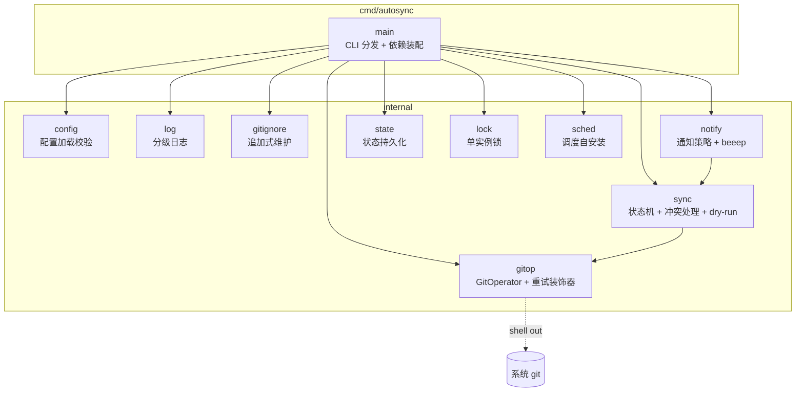
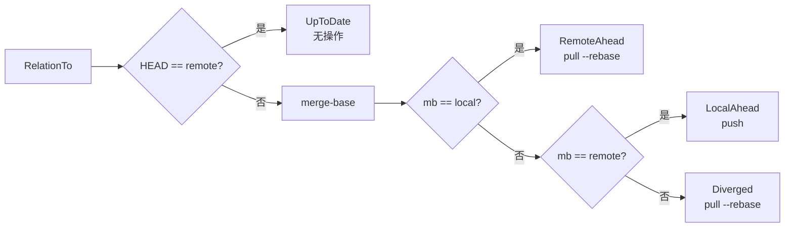

# TECH · 系统设计

> 解决"怎么建"：架构、模块边界、核心抽象与关键决策。业务流程见 [flow.md](flow.md)，命令接口见 [api.md](api.md)。

## 架构



程序不常驻。系统调度器按间隔触发 `autosync sync`，main 装配依赖后由 Syncer 执行一次状态机，结束即退出。

## 核心抽象

依赖倒置：Syncer 依赖 `GitOperator` 接口而非具体实现，便于装饰器扩展。

| 接口            | 位置   | 职责                           |
| --------------- | ------ | ------------------------------ |
| `GitOperator` | gitop  | git 操作抽象（读 / 写 / 冲突） |
| `Scheduler`   | sched  | 定时任务注册 / 移除            |
| `Notifier`    | notify | 系统通知投递                   |

装饰器：`retryGit` 嵌入 `GitOperator`，仅覆盖网络方法（Fetch / Push / PushForce / PushBranch / DeleteRemoteBranch），其余按嵌入委托。

## 关系四态



四态替代布尔"是否分叉"：布尔判定漏掉 RemoteAhead，该态直接 push 会非快进失败。

## 关键决策

- **`--force-with-lease`**：local_wins 强推用 lease 而非裸 `--force`，fetch 与 push 间远程被改写则拒绝。
- **单实例锁**：`O_EXCL` 创建锁文件写 PID；存活进程持有则跳过，已死 / 损坏则接管。`pidAlive` 跨平台（Unix `kill -0` / Windows `tasklist`）。
- **重试**：纯控制流 `Retry` 指数退避，装饰器仅覆盖网络方法。
- **追加式 .gitignore**：仅追加缺失条目，绝不覆盖用户既有配置。
- **配置宽松加载**：`LoadLenient` 跳过 repo_dir 存在性校验，供 status / install 在仓库未就绪时使用。

## 目录结构

```
cmd/autosync/      入口：CLI 分发与依赖装配
internal/config    配置加载 / 默认值 / 校验
internal/log       分级日志（文件 + 控制台，并发安全）
internal/gitignore .gitignore 追加式维护
internal/gitop     GitOperator 接口 + exec 实现 + 重试装饰器
internal/sync      同步状态机 / 冲突处理 / dry-run / backup 清理
internal/notify    通知策略 + beeep 实现
internal/state     上次同步状态持久化
internal/lock      单实例锁（PID，跨平台）
internal/sched     Scheduler 接口 + schtasks 实现
test/              全部测试（真实 git 临时仓库，禁止 mock）
```

## 平台策略

核心逻辑跨平台；平台差异用构建标签隔离（`//go:build windows` / `!windows`）。`pidAlive`、`Scheduler` 按平台分文件实现。路径用 `filepath`，不硬编码分隔符。

## 测试策略

- 全部测试在 `test/` 目录，包名 `tests`。
- 真实 git 临时仓库 + 裸远程驱动状态机，禁止 mock / fake / stub。
- `TestMain` 设置 git 提交身份，不依赖全局配置。
- 纯函数（Retry / BuildInstallArgs / PolicyFor）单测；状态机用真实仓库集成测。
