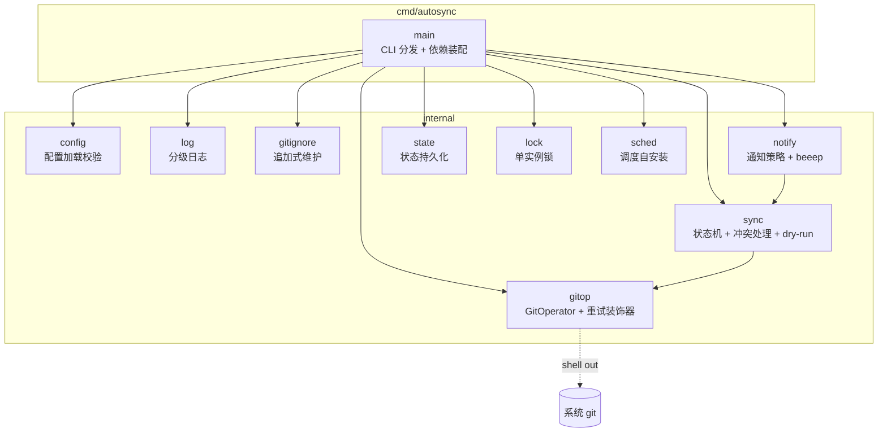
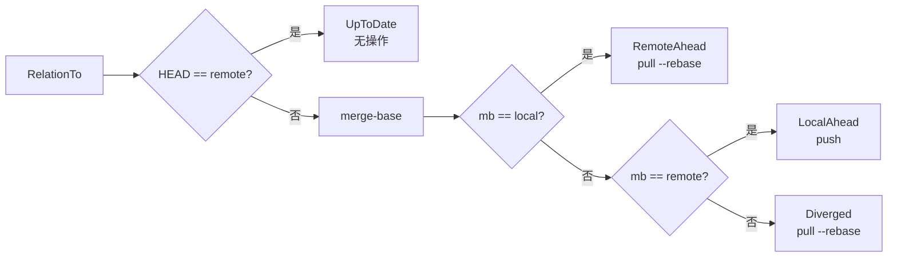
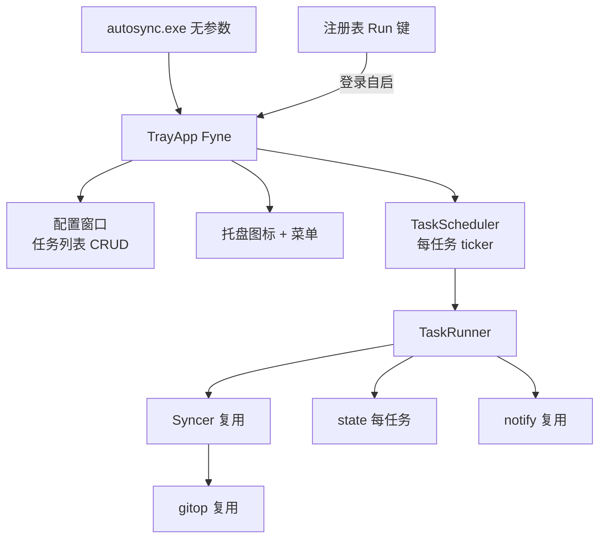
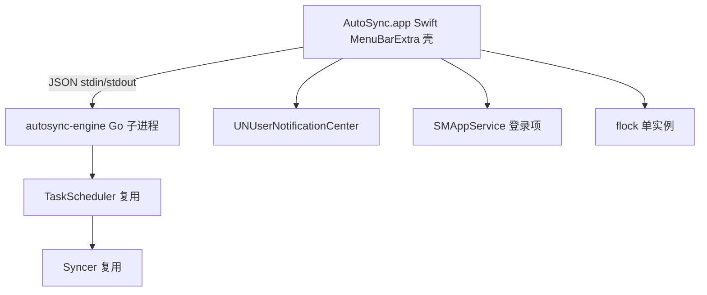

# TECH · 系统设计

> 解决"怎么建"：架构、模块边界、核心抽象与关键决策。业务流程见 [flow.md](flow.md)，命令接口见 [api.md](api.md)。

## 架构



程序不常驻。系统调度器按间隔触发 `autosync sync`，main 装配依赖后由 Syncer 执行一次状态机，结束即退出。

## 核心抽象

依赖倒置：Syncer 依赖 `GitOperator` 接口而非具体实现，便于装饰器扩展。

| 接口            | 位置   | 职责                           |
| --------------- | ------ | ------------------------------ |
| `GitOperator` | gitop  | git 操作抽象（读 / 写 / 冲突） |
| `Scheduler`   | sched  | 定时任务注册 / 移除            |
| `Notifier`    | notify | 系统通知投递                   |

装饰器：`retryGit` 嵌入 `GitOperator`，仅覆盖网络方法（Fetch / Push / PushForce / PushBranch / DeleteRemoteBranch），其余按嵌入委托。

## 关系四态



四态替代布尔"是否分叉"：布尔判定漏掉 RemoteAhead，该态直接 push 会非快进失败。

## 关键决策

- **`--force-with-lease`**：local_wins 强推用 lease 而非裸 `--force`，fetch 与 push 间远程被改写则拒绝。
- **单实例锁**：`O_EXCL` 创建锁文件写 PID；存活进程持有则跳过，已死 / 损坏则接管。`pidAlive` 跨平台（Unix `kill -0` / Windows `tasklist`）。
- **重试**：纯控制流 `Retry` 指数退避，装饰器仅覆盖网络方法。
- **追加式 .gitignore**：仅追加缺失条目，绝不覆盖用户既有配置。
- **配置宽松加载**：`LoadLenient` 跳过 repo_dir 存在性校验，供 status / install 在仓库未就绪时使用。

## 目录结构

```
cmd/autosync/         入口：CLI 分发与依赖装配
cmd/genicon          图标生成：SVG→PNG（oksvg 光栅化，仅改图标时运行）
internal/config      配置加载 / 默认值 / 校验 + byproduct 路径解析（~/.autosync/）
internal/log         分级日志（文件 + 控制台，并发安全）
internal/gitignore    .gitignore 追加式维护
internal/gitop        GitOperator 接口 + exec 实现 + 重试装饰器
internal/sync         同步状态机 / 冲突处理 / dry-run / backup 清理
internal/notify       通知策略 + beeep 实现
internal/state        上次同步状态持久化
internal/lock         单实例锁（PID，跨平台）
internal/configstore  多任务配置 Store（autosync.conf.yaml，CRUD + 持久化）
internal/tasksched    任务调度：每任务 ticker + TaskRunner 复用 Syncer
internal/tray         托盘守护应用（Fyne，构建标签 traygui 隔离）
internal/autostart    开机自启（Windows 注册表 Run 键 / macOS stub 由壳管 / Linux systemd user service）
internal/assets       嵌入图标资源（icon.svg → icon.png，供托盘/窗口/exe）
internal/engine       engine 子命令 IPC（macOS Swift 壳经 stdin/stdout JSON 调用）
test/                 全部测试（真实 git 临时仓库，禁止 mock）
macos/                Swift MenuBarExtra 原生壳工程（macOS GUI）
```

## byproduct 与路径

所有 byproduct 统一存放于各平台原生用户数据目录（可用 `AUTOSYNC_DATA_DIR` 覆盖），使 exe 位置独立（可装进只读目录、可任意位置打开）：

| 平台 | 数据目录 |
|------|----------|
| Windows | `%AppData%\AutoSync` |
| macOS | `~/Library/Application Support/AutoSync` |
| Linux | `~/.config/AutoSync` |

```
<数据目录>/
  config.yaml                 # CLI 单任务配置
  autosync.conf.yaml          # 托盘多任务配置
  logs/autosync.log           # 日志（CLI + 守护共享）
  state/autosync.state-<name>.json   # 每任务状态
  locks/autosync.lock-<name>         # 每任务锁 / 守护锁 autosync.daemon.lock
```

路径解析集中于 `internal/config/paths.go`（`UserDataDir` / `LogFilePath` / `StateFilePath` / `LockFilePath` 等），`log`/`state`/`lock` 包只接收路径不解析。

## 平台策略

main 分支统一维护三平台（Windows + macOS + Linux），核心逻辑跨平台；平台差异用构建标签隔离（`//go:build windows` / `darwin` / `!windows && !darwin`）。`pidAlive`、`autostart` 按平台分文件实现；`tray` 用 `traygui` 标签隔离 Fyne（Windows）；macOS GUI 由 Swift `MenuBarExtra` 原生壳承担，Go 引擎以 `engine` 子命令作子进程经 stdin/stdout JSON IPC 供壳调用（见 V1.2 架构）；Linux 走 `daemon` 子命令 + systemd user service（无 GUI，对齐 Syncthing/Rclone）。路径用 `filepath`，不硬编码分隔符。

## V1.1 架构：托盘守护

V1.1 在 V1.0 引擎之上加托盘守护层，引擎（Syncer / gitop / notify / state / lock）进程内复用，不启子进程。



- **进程模型**：无参数启动 = 托盘守护（常驻 + 内置 ticker）；`autosync sync` = 一次性 CLI（脚本 / 无头）。单实例锁防多开。
- **多任务**：`autosync.conf.yaml` 的 `tasks: [...]`，每任务独立 state（`autosync.state-<name>.json`）与 lock。旧单配置无 `tasks` 视为单任务（向后兼容）。
- **GUI**：Fyne（纯 Go，窗口 + 托盘一体，跨平台）。
- **自启**：`install` / `uninstall` 改为注册表 `HKCU\...\Run` 键开关（替代 schtasks）。非 Windows 不支持。
- **托盘菜单**：各任务手动同步 / 暂停、开机自启开关、打开配置、退出（同步状态经 `autosync status` 查询）。

## V1.2 架构：macOS 原生壳 + 引擎子进程

V1.2 在 V1.1 引擎之上为 macOS 加 Swift `MenuBarExtra` 原生壳，Go 引擎以 `engine` 子命令作子进程经 stdin/stdout JSON IPC 供壳调用。引擎核心三平台共享，仅入口与平台层分化。



- **进程模型**：macOS 双进程（壳 + 引擎），壳管 GUI/自启/通知/单实例，引擎管同步调度；Windows 仍单进程 Fyne 托盘。
- **IPC**：JSON 行协议（`internal/engine/protocol.go`），命令 status/sync-now/pause/resume/config-list/config-save/quit，事件 ready/status/sync-result/notify/bye 等。
- **依赖倒置**：`tasksched` 的 Notifier 与 onResult 回调由调用方注入（Windows beeep / macOS IPC 委托壳）。
- **分发**：未签名 DMG + `xattr` 文档（起步），后续可升级 Developer ID 公证。

## 测试策略

- 全部测试在 `test/` 目录，包名 `tests`。
- 真实 git 临时仓库 + 裸远程驱动状态机，禁止 mock / fake / stub。
- `TestMain` 设置 git 提交身份，不依赖全局配置。
- 纯函数（Retry / BuildInstallArgs / PolicyFor）单测；状态机用真实仓库集成测。
